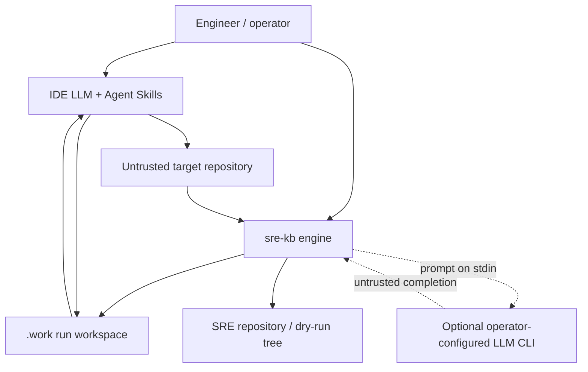
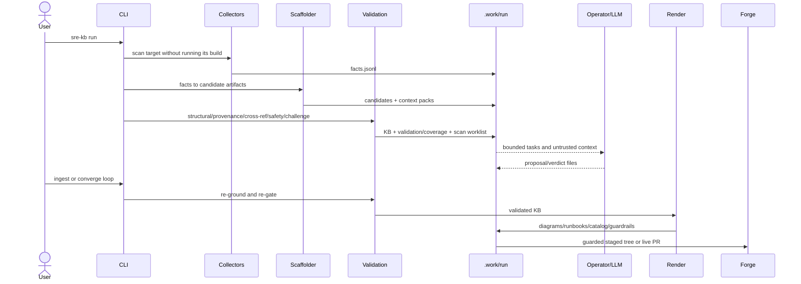

# Architecture

## System context

The target and model output are untrusted inputs. The work directory is the file-exchange and stage
checkpoint boundary. Live publication is optional and goes through the Forge seam.
[`STATIC_EXTRACTED`: `src/sre_kb/collectors/base.py:44-108`,
`src/sre_kb/llm/provider.py:37-97`, `src/sre_kb/publish/pr_builder.py:272-332`]

## Component model

| Component | Responsibility | Evidence |
|---|---|---|
| CLI | Exposes run, schema, validation, estate, worklist, gap, generation, security, and publish operations | `src/sre_kb/cli.py:28-1269` |
| Collectors | Bounded, no-build static extraction into `FactSet` | `src/sre_kb/collectors/__init__.py:1-85`; `collectors/base.py:44-108` |
| Parsing/models | Cross-language syntax representation and provenance-bearing fact vocabulary | `src/sre_kb/parsing/`; `src/sre_kb/models/facts.py:24-55` |
| Synthesis | Turns facts into schema-shaped candidates and LLM worklist tasks | `src/sre_kb/synth/scaffold.py:118`; `src/sre_kb/synth/worklist.py:31` |
| Pipeline | Owns stage ordering, disk handoffs, bounded proposal ingests, and final status | `src/sre_kb/pipeline/orchestrator.py:48-334` |
| Validation | Structural, provenance, cross-reference, safety, substance, and challenge checks | `src/sre_kb/pipeline/orchestrator.py:172-257`; `src/sre_kb/validation/` |
| Registry/schemas | Extensibility and artifact contract backbone | `src/sre_kb/schemas/registry.yaml:1-101`; `src/sre_kb/registry.py` |
| Render/publish | Converts KB artifacts into diagrams/runbooks/catalog/guardrails and a guarded PR tree | `src/sre_kb/render/project.py:27-116`; `src/sre_kb/publish/pr_builder.py:246-332` |
| Codebase atlas | Builds a separate versioned repository-understanding graph, imports reviewed evidence overlays, computes raw dependency metrics, and renders drift-gated visual projections | `src/sre_kb/atlas/`; `.sre/atlas.yaml` |
| LLM provider seam | Defaults to manual Copilot file exchange; optionally invokes an operator command on stdin | `src/sre_kb/llm/provider.py:37-180` |
| Agent Skills | Guide the judgment half and neutral-artifact authoring by concern | `.github/skills/pipeline.yaml:9-42` |

Every row is `STATIC_EXTRACTED`.

## Main execution path

The stage vocabulary is `scan → scaffold → validate → render → publish`.
[`STATIC_EXTRACTED`: `src/sre_kb/pipeline/orchestrator.py:48-334`]

## Trust boundaries

- **Target filesystem:** collectors prune generated/cache trees, skip symlinks and files over 2 MB,
  and do not execute the target build.
  [`STATIC_EXTRACTED`: `src/sre_kb/collectors/base.py:24-108`]
- **Atlas boundary:** `.sre/atlas.yaml` explicitly names source/test roots and local overlays.
  Paths must remain inside the repository; symlinks and files over 2 MB are rejected, DTD/entity XML
  is refused, and no target build or live environment is contacted.
  [`STATIC_EXTRACTED`: `src/sre_kb/atlas/config.py`, `evidence.py`, `overlays.py`]
- **LLM input/output:** context is framed as untrusted; the default provider performs no synchronous
  call. The subprocess provider accepts only an operator-configured command and sends the prompt on
  stdin. [`STATIC_EXTRACTED`: `src/sre_kb/llm/provider.py:37-97`]
- **Artifact trust:** current pipeline source runs schema, provenance, cross-reference, output-safety,
  substance, and adversarial challenge checks before final status.
  [`STATIC_EXTRACTED`: `src/sre_kb/pipeline/orchestrator.py:172-257`]
- **Rendering:** Mermaid labels pass through a shared sanitizer; renderer class/style vocabulary is
  fixed by the engine. [`STATIC_EXTRACTED`: `src/sre_kb/render/diagrams.py:1-146`]
- **Publication:** the staged tree is path-contained, re-created, secret-scanned, and only then passed
  to a configured Forge. [`STATIC_EXTRACTED`: `src/sre_kb/publish/pr_builder.py:272-332`]

## LLM and engine responsibilities

### Current source behavior

The current implementation treats the engine as the trust gate for LLM proposals: it relocates cited
bytes, applies downgrade-only checks, and can reject or route material to human review. The
`LLMProvider` module explicitly describes the model as a pointer-generator whose output is re-grounded
and gated. [`STATIC_EXTRACTED`: `src/sre_kb/llm/provider.py:1-20`;
`src/sre_kb/pipeline/orchestrator.py:172-257`]

### Current skill and agent direction

The Copilot instructions, skills, and agents have adopted the model described by
`docs/LLM-FIRST-PORT.md`: the LLM reads across files and emits governed neutral artifacts while
engine evidence enhances rather than silently erases supported findings. This instruction-level
contract has changed; the deterministic runtime described above has not.
[`STATIC_EXTRACTED`: `AGENTS.md`; `.github/copilot-instructions.md`;
`.github/skills/map-architecture/SKILL.md`; `.github/agents/sre-analyst.agent.md`]

### Atlas contract

This atlas keeps the instruction contract and executable behavior separate:

1. LLM/source inspection builds a broad cross-file understanding model.
2. Direct citations retain their own evidence label.
3. Engine output adds `ENGINE_CONFIRMED` evidence when available.
4. Current engine validation behavior remains accurately documented until the runtime changes.
5. Design/source disagreements remain visible in [CONCERNS.md](CONCERNS.md).

A fresh self-scan traversed this entire stage path through publish and produced 157 facts, 72
artifacts, reports, projections, and a guarded PR tree. Because direct root scanning aggregated the
repository's bundled service fixtures, this is `ENGINE_CONFIRMED` execution evidence but not a
truthful business-topology model for `sre-design`.

## Evidence

- `src/sre_kb/pipeline/orchestrator.py:48-334` — implemented stage and gate behavior.
  [`STATIC_EXTRACTED`]
- `src/sre_kb/llm/provider.py:1-180` — implemented transport and trust seam.
  [`STATIC_EXTRACTED`]
- `src/sre_kb/render/project.py:27-116` and `render/diagrams.py:1-320` — implemented projection and
  diagram behavior. [`STATIC_EXTRACTED`]
- `AGENTS.md`, `.github/copilot-instructions.md`, `.github/skills/map-architecture/SKILL.md`, and
  `.github/agents/sre-analyst.agent.md` — current instruction-facing contract.
  [`STATIC_EXTRACTED`]
- `docs/LLM-FIRST-PORT.md:1-21,92-125` — design rationale, not current-runtime evidence.
  [`MANIFEST_DECLARED`]
