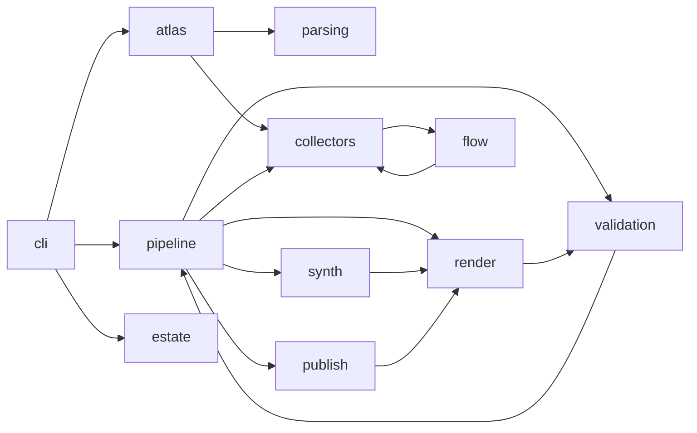
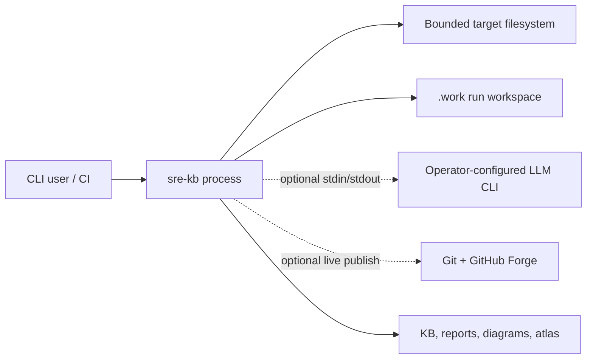

# Dependencies

## Graph scopes

The atlas keeps dependency evidence in separate scopes so a declaration is never presented as a
runtime observation:

| Scope | Edge meaning | Evidence ceiling |
|---|---|---|
| `package` | A structured manifest declares a package or a lock/assets file resolves package nodes and edges | `MANIFEST_DECLARED` or `STATIC_RESOLVED`, retained per evidence item |
| `source` | A language-aware resolver maps production source A to repository source B | `STATIC_RESOLVED` |
| `test` | A language-aware resolver maps test source to source/test code | `STATIC_RESOLVED` |
| `source-external` | An import string is exact but package/module identity is not resolved | `STATIC_EXTRACTED`; edge remains unresolved |
| `sbom` | An imported CycloneDX `ref`/`dependsOn` relationship | `MANIFEST_DECLARED` |
| `runtime` | A reviewed runtime-evidence file records an observed relationship | `RUNTIME_OBSERVED` |

The canonical graph is [`generated/atlas.json`](generated/atlas.json), validated by its bundled
[JSON Schema](generated/CodebaseAtlas.schema.json). Human-readable raw metrics and blind spots are
in the generated [dependency snapshot](generated/DEPENDENCY-SNAPSHOT.md), and the bounded package
view is in the generated [source graph](generated/source-graph.md).

## Internal source graph

The committed snapshot currently contains:

| Granularity | Nodes | Distinct directed edges | Non-trivial SCCs |
|---|---:|---:|---:|
| Production Python module | 138 | 439 | 0 |
| `sre_kb.<top-level-package>` group | 30 | 100 | 2 |

The Python adapter uses `ast`, resolves absolute and relative imports against the known module map,
and cites the exact import line. Java, C#, JavaScript, TypeScript/TSX, and Go adapters use the
repository's tree-sitter grammars. Node resolution consumes package metadata, npm lockfiles,
literal package imports, and configured TypeScript aliases. .NET resolution consumes SDK/TFM,
central-package, project-reference, and NuGet lock/assets evidence. Other package/build adapters
parse TOML, JSON, XML, and `go.mod` structurally.

MSBuild evaluation, Gradle executable build logic, conditional/dynamic module loading, and
reflection become explicit unknowns rather than regex-derived edges.

## Cycles

The package-level strongly connected groups remain:

1. `sre_kb.collectors` ↔ `sre_kb.flow`
2. `sre_kb.pipeline` ↔ `sre_kb.publish` ↔ `sre_kb.render` ↔ `sre_kb.synth` ↔
   `sre_kb.validation`

These are not Python circular-import failures: the module graph is acyclic. Package collapsing
exposes architectural bidirectionality useful for ownership and extraction planning. No incident
severity or health grade is inferred.

This diagram is a small orientation view. Use the generated projection for the complete resolved
package graph.

## Coupling metrics

For every resolved source node and package group, the generated snapshot reports:

- `Ca`: distinct incoming neighbors;
- `Ce`: distinct outgoing neighbors;
- `I = Ce / (Ca + Ce)`.

`Ca` is also the in-repository caller/change-impact overlay. Test imports are retained under the
separate `test` scope so production coupling is not inflated by the test suite.

The metrics are raw structural measurements. They deliberately do not assign “good,” “bad,”
severity, or refactoring priority.

## Incoming dependencies

The graph contains repository-local incoming source and test callers. External consumers remain
`UNKNOWN` until fleet search, package-consumer data, contracts, gateway records, or traces are
imported. A repository cannot prove its complete downstream consumer set from its own source.

## Runtime and service graph

This is a static process-boundary view, not observed runtime topology. No runtime-evidence file is
configured for the self-atlas, so the generated [runtime graph](generated/runtime-graph.md) correctly
reports no imported runtime edges. Atlas generation never reaches into a live environment.

## Package, SBOM, and license relationships

`pyproject.toml` and `requirements.lock` produce declared/locked package nodes. A configured
CycloneDX JSON file can add components, `bom-ref` identity, declared licenses, and
`dependencies[].dependsOn` edges without executing a build. The local
[license inventory](generated/licenses.json) currently records identities and an `UNKNOWN` license
status where no reviewed SBOM/license assertion exists.

Import-package mapping remains conservative. For example, a Python distribution name is not
assumed to equal its import name; `PyYAML`/`yaml` is the familiar reason that shortcut is unsafe.

## Unknown edges

- The single dynamic Python import in the current scoped test tree is recorded as an unknown.
- Reflection, plugin registries, generated code, build-time aliases, and conditionally loaded
  modules require resolver-specific or runtime evidence.
- Raw `.csproj` and solution files do not prove configuration-specific MSBuild edges; conditions,
  imports, and solution-only dependencies require an evaluated, reviewed `ProjectGraph`.
- Node conditional exports/imports, loader hooks, and non-literal dynamic imports require a
  dedicated resolver or runtime evidence even when the npm lock graph is complete.
- The source graph proves syntactic dependency resolution, not execution reachability.
- The current self-atlas imports no trace, service-mesh, gateway, or deployment topology.
- Cross-repository callers and downstream package consumers are not visible in this checkout.
- Change frequency is available with `sre-kb atlas --include-history`, but is excluded from the
  committed drift gate because checkout history depth is not stable.

## Evidence

- [`.sre/atlas.yaml`](../../.sre/atlas.yaml) — authoritative project roots, exclusions, overlays,
  and output boundary. [`MANIFEST_DECLARED`]
- [`generated/atlas.json`](generated/atlas.json) — versioned nodes, edges, evidence, unknowns,
  coupling, cycles, and license inventory. [`ENGINE_CONFIRMED`]
- `src/sre_kb/atlas/source.py` — AST/tree-sitter source resolvers. [`STATIC_EXTRACTED`]
- `src/sre_kb/atlas/manifests.py` — structured package/build adapters.
  [`STATIC_EXTRACTED`]
- `src/sre_kb/atlas/overlays.py` — runtime, CycloneDX, coverage, CODEOWNERS, and history imports.
  [`STATIC_EXTRACTED`]
