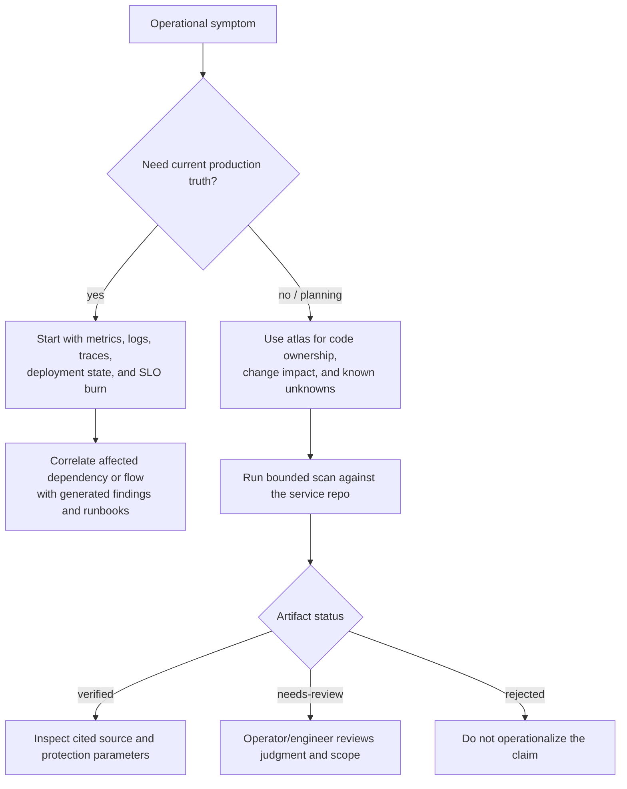

# Operations

## Declared setup

Prerequisite: Python 3.13 or newer. The repository's primary declared developer path is:

```text
python -m venv .venv
python -m pip install -e ".[dev]"
```

The Makefile wraps installation as `make install`. On Windows, activate the environment with the
shell-appropriate script rather than the POSIX activation example in the README.
[`MANIFEST_DECLARED`: `pyproject.toml:12`; `Makefile:3-5`; `README.md` Quickstart]

The documented PowerShell path now calls the Python 3.13 environment directly:

```text
py -3.13 -m venv .venv
.\.venv\Scripts\python.exe -m pip install -e ".[dev]"
.\.venv\Scripts\python.exe -m pytest -q
```

This avoids silently reusing a stale environment and does not require activation.

## Verify

| Command | Snapshot status | Purpose |
|---|---|---|
| `python tools/lint_skills.py` | `VERIFIED` 2026-07-30 | Agent Skill/pipeline contract |
| Focused atlas/resolver/portability tests | `VERIFIED`: passed | Schema, drift, resolvers, overlays, links, Windows oracle handling, UTF-8 reads |
| `sre-kb atlas --target .` | `VERIFIED` 2026-07-30 | Regenerate JSON/schema/Markdown/Mermaid/HTML evidence |
| `sre-kb atlas-check --target .` | `VERIFIED`: no drift | CI-ready generated-output comparison and JSON drift report |
| `python -m ruff check src tests` | `VERIFIED`: passed | Full source/test lint |
| Hash-verified `requirements.lock` install | `VERIFIED` in an isolated Python 3.13 environment | Locked artifact integrity and platform availability |
| `pip-audit -r requirements.lock --no-deps` | `VERIFIED`: no known vulnerabilities found | Current locked-runtime advisory check |
| Full pytest + coverage floor | `VERIFIED`: 903 passed, 2 capability skips; coverage 91.34% | Full repository regression and 90% floor |
| Clean `sre-kb run … --to-stage publish` self-scan | `VERIFIED`: completed | End-to-end stage and output contract |

The original `.venv` remains stale (Python 3.12.10, missing declared grammars/dev packages). An
isolated `.work/codex-venv` using Python 3.13.14 was used instead, so verification did not
replace the user's environment.

Node.js `v24.16.0` and npm `11.13.0` are available on the verification workstation. The installed
`dotnet` host includes the .NET 8 runtime, but `dotnet --info` reports no SDK. Consequently, the
.NET 8 resolver behavior is `VERIFIED` through deterministic project/lock/assets fixtures; a live
`dotnet build` or `Microsoft.Build.Graph` export is `BLOCKED` until an SDK is provisioned.

## Run

The stage path is:

```text
sre-kb run --target <repo> --run <id> --to-stage publish
```

Use a fixed run ID when a repeatable handoff path matters. Earlier safe stopping points are
`scan`, `scaffold`, `validate`, and `render`. `publish` assembles a dry-run PR tree unless live
publication is explicitly selected through the publish command/configuration.
[`STATIC_EXTRACTED`: `src/sre_kb/pipeline/orchestrator.py:48-334`; `src/sre_kb/cli.py:296-393`]

Useful declared inspection paths:

- `sre-kb schema list` — registry/kind inventory;
- `sre-kb human-report --target <repo>` — safely scan a checkout and produce a five-pass
  plain-language report covering purpose, flows, external dependencies/service destinations,
  resilience, and next actions (`--run <id>` reuses a scan; `--format json` is also available);
- `sre-kb atlas --target <repo>` — generate the bounded codebase evidence graph;
- `sre-kb atlas-check --target <repo>` — fail on stale generated projections;
- `sre-kb findings --run <id>` — ranked evidence-linked findings;
- `sre-kb scan-worklist --run <id>` — remaining LLM/operator tasks;
- `sre-kb estate --target <repo-a> --target <repo-b>` — cross-service topology.

These commands are `MANIFEST_DECLARED`/`STATIC_EXTRACTED`, not freshly runtime-verified in this
snapshot.

## Diagnose

### SRE triage path



The atlas is best used to form and bound hypotheses. It cannot answer whether a circuit breaker is
currently open, retries are exhausting a dependency, a DLQ is growing, or an SLO is burning because
no live runtime evidence is configured. [`UNKNOWN`: needs deployment and telemetry evidence]

1. Check interpreter compatibility before debugging engine behavior: `python --version` must satisfy
   `pyproject.toml`.
2. Check all nine tree-sitter grammar packages and `ast-grep-py` are installed if CLI import or
   scanning fails. Dockerfile extraction is local Python code because the candidate grammar has no
   Windows wheel.
3. Inspect `.work/<run>/reports/validation_report.json` for stage status and artifact-specific
   structural/provenance/cross-reference/safety results.
4. Inspect `.work/<run>/reports/coverage.json` for files the collectors walked but no fact cited.
5. Inspect `.work/<run>/scan-worklist.json` when the run is valid but judgment tasks remain.
6. Keep `kb/verified`, `kb/needs-review`, and `reports/rejected` distinct; a healthy process exit is
   not proof that every artifact verified.
7. For publication failures, check the staged tree and secret-gate output before Forge/network
   diagnostics.

## Outputs

```text
.work/<run>/
├── facts/facts.jsonl
├── candidates/
│   └── context/                 untrusted-input-framed evidence packs
├── kb/
│   ├── verified/
│   └── needs-review/
├── reports/
│   ├── validation_report.json
│   ├── coverage.json
│   └── rejected/
├── scan-worklist.json
├── projections/
│   ├── .github/
│   ├── diagrams/
│   ├── runbooks/
│   └── catalog-info.yaml
└── pr/                          staged publication tree
```

Core run directories come from `RunLayout`; projection and publication code adds the later outputs.
[`STATIC_EXTRACTED`: `src/sre_kb/workspace/layout.py:1-51`,
`src/sre_kb/render/project.py:94-116`, `src/sre_kb/publish/pr_builder.py:246-317`]

## Runtime evidence gaps

The initial self-scan attempt in the stale environment used:

```text
.\.venv\Scripts\sre-kb.exe run --target . --run atlas-baseline --to-stage publish
```

It stopped before scanning with:

```text
ModuleNotFoundError: No module named 'tree_sitter_go'
```

That attempt was `BLOCKED`, not a product failure. After provisioning an isolated declared
environment, the clean self-scan completed:

```text
run verified-clean: 157 facts, 72 artifact(s)
  verified: 66
  needs-review: 6
  files walked: 462
  files covered by facts: 50
```

The first compliant self-scan revealed that `.work` was being walked recursively. The scan boundary
was fixed to prune `.work` and conventional generated/cache trees; a regression test now proves a
prior run's generated Python file is not re-ingested.

The Windows portability failures found during the first run were corrected: native Windows command
lines are preserved with `shell=False`, cross-platform Python echo oracles replace Unix `cat`,
generated UTF-8 files are read explicitly as UTF-8, and symlink tests probe account/filesystem
capability. The two skips are those symlink capability checks under an account without symlink
privilege; all executable assertions passed.

No live target deployment, GitHub publication, external LLM CLI, or production telemetry was invoked
for this atlas.

## Evidence

- `pyproject.toml:12-31` — runtime floor and dependency set. [`MANIFEST_DECLARED`]
- `.github/workflows/ci.yml:12-72` — declared CI Python and checks.
  [`MANIFEST_DECLARED`]
- `Makefile:3-29` — declared developer operations. [`MANIFEST_DECLARED`]
- Local 2026-08-29 Python 3.13.14 run — Ruff passed; 903 tests passed, 2 capability skips; 91.34%
  coverage. [`RUNTIME_OBSERVED`, development workstation only]
- Local Node/npm version checks, `dotnet --info`, hash-verified lock install, and `pip-audit`
  — Node `v24.16.0`, npm `11.13.0`, .NET 8 runtime present with no SDK, lock install passed, and no
  known locked-runtime vulnerabilities found. [`RUNTIME_OBSERVED`, development workstation only]
- `.work/atlas-self/verified-clean/reports/validation_report.json` — 157 facts, 72 artifacts,
  66 verified, 6 needs-review. [`ENGINE_CONFIRMED`, local self-scan only]
