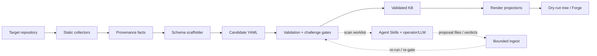

# Codebase atlas

## Snapshot

| Field | Value |
|---|---|
| Repository | `sre-design` / Python package `sre-kb` |
| Baseline commit | `65983b23d09e0f2b3b0470b9c81f42aa136b1f9b` |
| Baseline commit date | 2026-07-23 |
| Atlas date | 2026-07-30 |
| Scope | Explicit projects/roots in [`.sre/atlas.yaml`](../../.sre/atlas.yaml), plus reviewed docs and operational evidence |
| Excluded | `.git/`, `.venv/`, `.work/`, caches, generated artifacts, and live systems |
| Machine snapshot | [`generated/atlas.json`](generated/atlas.json), with bundled schema and file hashes |
| Current evidence ceiling | Structured manifests, AST/tree-sitter resolution, and a fresh local engine self-scan; no live runtime import |

The source model was frozen before the design documents were used for intent comparison. The local
Python 3.12 virtual environment was stale, so validation moved to an isolated Python 3.13.14
environment under ignored `.work/`. The clean self-scan completed with 157 facts and 72 artifacts
(66 verified, 6 needs-review). Its artifacts aggregate bundled test fixtures under a fixture-derived
service identity, so they confirm engine execution and output contracts—not this repository's
business-service topology. See [OPERATIONS.md](OPERATIONS.md).

## System in one sentence

`sre-kb` is a model-neutral Python CLI that statically collects provenance-bearing SRE facts from a
target repository, scaffolds and validates schema-governed knowledge-base artifacts, exchanges
bounded judgment tasks with an LLM/operator, and renders/publishes operational projections.
[`STATIC_EXTRACTED`: `src/sre_kb/pipeline/orchestrator.py:48-334`,
`src/sre_kb/llm/provider.py:1-42`]

## Choose a tour

| You are… | Start here | Then |
|---|---|---|
| New contributor | [STACK.md](STACK.md) | [STRUCTURE.md](STRUCTURE.md) → [OPERATIONS.md](OPERATIONS.md) |
| Engineer planning a change | [ARCHITECTURE.md](ARCHITECTURE.md) | [DEPENDENCIES.md](DEPENDENCIES.md) → the package and tests named by [STRUCTURE.md](STRUCTURE.md) |
| Operator diagnosing a run | [OPERATIONS.md](OPERATIONS.md) | [ARCHITECTURE.md](ARCHITECTURE.md#main-execution-path) → [CONCERNS.md](CONCERNS.md) |
| LLM/Agent Skill maintainer | [ARCHITECTURE.md](ARCHITECTURE.md#llm-and-engine-responsibilities) | `sre-codebase-cartographer` → `.github/skills/sre-codebase-atlas/` → `tests/test_skills.py` |
| Anyone exploring interactively | [Generated HTML atlas](generated/atlas.html) | Filter nodes, edges, scopes, owners, and explicit unknowns offline |

## System map

The solid path is the deterministic engine. The dashed loop is the bounded LLM/operator exchange.

Evidence: pipeline stages and handoffs are defined in
`src/sre_kb/pipeline/orchestrator.py:48-334`; the default model-free file provider and optional
subprocess provider are in `src/sre_kb/llm/provider.py:37-97`; render dispatch is in
`src/sre_kb/render/project.py:27-116`. [`STATIC_EXTRACTED`]

## Evidence model

This atlas uses the labels defined by the
[atlas evidence model](../../.github/skills/sre-codebase-atlas/references/evidence-model.md):

- `MANIFEST_DECLARED`, `STATIC_EXTRACTED`, and `STATIC_RESOLVED` for repository evidence;
- `ENGINE_CONFIRMED`, `RUNTIME_OBSERVED`, and `OPERATOR_CONFIRMED` for stronger confirmations;
- `INFERRED` and `UNKNOWN` when the evidence ceiling is explicit.

The successful self-scan and its run outputs are `ENGINE_CONFIRMED`; local interpreter/test results
are `RUNTIME_OBSERVED`. No deployed service or production behavior was observed.

## Known unknowns

- The deployed topology, traffic, latency, failure behavior, and current production configuration
  were not observed. [`UNKNOWN`: needs runtime telemetry/deployment evidence]
- The complete set of external users and service consumers cannot be derived from this repository
  alone. [`UNKNOWN`: needs fleet repositories, gateway records, contracts, or traces]
- The planned LLM-first contract in `docs/LLM-FIRST-PORT.md` is not yet the uniform current source
  contract; current code and skills contain both engine-gated and engine-enhanced models.
- Project license terms and dependency license assertions remain unknown until maintainers choose a
  project license and import a reviewed SBOM/license source.

## Atlas pages

- [Technology stack](STACK.md)
- [Repository structure](STRUCTURE.md)
- [Architecture](ARCHITECTURE.md)
- [Dependencies](DEPENDENCIES.md)
- [Operations](OPERATIONS.md)
- [Concerns and open questions](CONCERNS.md)
- [Generated evidence, diagrams, schemas, and explorer](generated/README.md)
