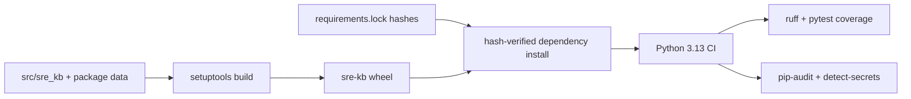

# Technology stack

## Runtime and language

| Layer | Technology | Version evidence | Role |
|---|---|---|---|
| Runtime | Python | `>=3.13` | Engine and CLI |
| Package/build | setuptools | build requirement `>=68` | Build backend and `src/` package discovery |
| CLI | Typer | direct dependency `>=0.12` | `sre-kb` command tree |
| Data contracts | Pydantic + JSON Schema | direct dependencies `>=2.6`, `>=4.21` | Fact/artifact models and structural validation |
| Serialization/config | PyYAML + pydantic-settings | direct dependencies `>=6.0`, `>=2.14.2` | YAML KB/config loading |
| Rendering | Jinja2 + Mermaid text | Jinja2 `>=3.1`; Mermaid is emitted text, not a Python package | Markdown, runbooks, diagrams, and projections |
| Static parsing | tree-sitter plus six grammar packages | each declared `>=0.23` | Java, C#, Python, JavaScript, TypeScript/TSX, and Go source models |
| Codebase atlas | Pydantic model + stdlib AST/XML/TOML/JSON + tree-sitter | `sre.kb/atlas/v1alpha1` | Versioned evidence graph, metrics, overlays, drift gate, and offline explorer |

All version values above are declarations, not claims about the active environment.
[`MANIFEST_DECLARED`: `pyproject.toml:1-34`]

## Frameworks and libraries

The direct runtime dependency groups are:

- schema/model: `jsonschema`, `pydantic`, `pydantic-settings`;
- interface/config/render: `typer`, `pyyaml`, `jinja2`;
- syntax extraction: `tree-sitter`, `tree-sitter-java`, `tree-sitter-c-sharp`,
  `tree-sitter-python`, `tree-sitter-javascript`, `tree-sitter-typescript`, `tree-sitter-go`.

The development group declares `pytest`, `pytest-cov`, `hypothesis`, and `ruff`.
[`MANIFEST_DECLARED`: `pyproject.toml:13-31`]

The engine recognizes target repositories built with Java/Spring, .NET/Steeltoe, Python/FastAPI,
Node/Express, and Go. That is analyzer coverage, not the implementation stack of `sre-kb` itself.
[`STATIC_EXTRACTED`: `src/sre_kb/collectors/__init__.py:11-76`]

The atlas layer additionally resolves .NET SDK/target-framework and NuGet lock evidence plus
Node/npm lock, workspace metadata, TypeScript/TSX source, and configured alias evidence. Raw
MSBuild project references remain declared until an evaluated `ProjectGraph` is imported.
[`STATIC_EXTRACTED`: `src/sre_kb/atlas/manifests.py`, `src/sre_kb/atlas/source.py`]

## Build and delivery

- The console entry point is `sre-kb = sre_kb.cli:main`.
  [`MANIFEST_DECLARED`: `pyproject.toml:33-34`]
- Schemas, default data, and Jinja templates are package data.
  [`MANIFEST_DECLARED`: `pyproject.toml:38-41`]
- CI runs on Python 3.13, installs the dev package, lints, enforces coverage, performs a
  hash-verified lockfile install, audits known vulnerabilities, and runs a second secret gate.
  [`MANIFEST_DECLARED`: `.github/workflows/ci.yml:12-72`]
- `scripts/build-offline.sh` and the `offline-wheel` Make target build the air-gapped wheelhouse.
  [`MANIFEST_DECLARED`: `Makefile:25-26`]

## Version and license status

| Item | Status |
|---|---|
| Project version | `0.0.1` in `pyproject.toml` |
| Runtime constraint | Python `>=3.13` |
| Direct dependency declarations | Lower-bounded ranges |
| Resolved dependency snapshot | `requirements.lock` is checked in with hashes |
| Project license | `UNKNOWN`: no root `LICENSE*` file and no `project.license` field in the inspected snapshot |
| Dependency identities | Generated [license inventory](generated/licenses.json) records 48 scoped package/import identities |
| Dependency licenses | `UNKNOWN` where no reviewed CycloneDX/license assertion exists; the lockfile proves identity/integrity, not license terms |

The atlas deliberately does not infer licenses from package names. It can import CycloneDX component
licenses and dependency edges, but a reviewed SBOM/license source and a maintainer-selected project
license are still needed to close the legal unknowns.

## Evidence

- `pyproject.toml:1-57` — package metadata, runtime dependencies, entry point, test, and lint
  configuration. [`MANIFEST_DECLARED`]
- `requirements.lock` — resolved dependency artifacts and hashes. [`MANIFEST_DECLARED`]
- `.github/workflows/ci.yml:12-72` — current checked-in CI matrix and gates.
  [`MANIFEST_DECLARED`]
- `src/sre_kb/collectors/__init__.py:11-76` — enabled target-language collectors.
  [`STATIC_EXTRACTED`]
- [`generated/licenses.json`](generated/licenses.json) — machine-readable project/dependency license
  status. [`ENGINE_CONFIRMED`]
